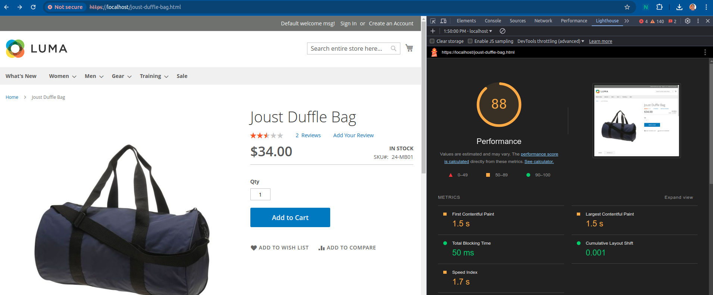
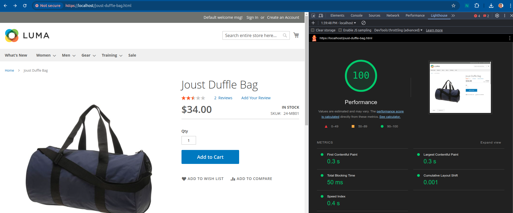
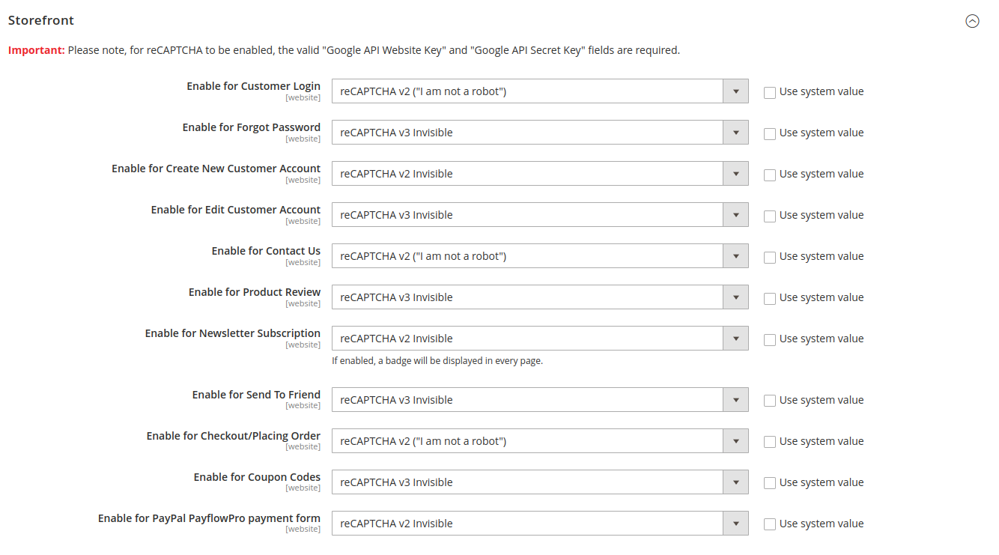

# Magento 2 Smart reCaptcha Loader

[](https://packagist.org/packages/serfe/magento2-smart-recaptcha-loader)[](https://packagist.org/packages/serfe/magento2-smart-recaptcha-loader)

Boost your Magento 2 store's performance and user experience with the **Smart reCaptcha Loader** module. This extension loads the reCAPTCHA API only when users interact with form fields, improving initial page load times without compromising security.

## Key Features

- **On-Demand reCAPTCHA Loading**: Triggers the reCAPTCHA API only when a form field is focused, enhancing initial page performance.
- **Performance Optimization**: Reduces unnecessary reCAPTCHA loads, creating a smoother and faster user experience.
- **Enhanced User Interaction**: Keeps the page light and responsive until user interaction, ensuring optimal load times.

## Performance Comparison

### Product Detail Page (PDP) Performance
Below are performance comparisons on the Product Detail Page (PDP), using Magento 2.4.7-p3, Luma theme, and sample data:

#### Without the Module Enabled:


#### With the Module Enabled:


These images illustrate how the module reduces script load by deferring reCAPTCHA until it's needed.

### On-Focus Loading in Action
See the GIF below to observe how the module loads reCAPTCHA only when the user focuses on a form field:


## Installation Guide

To install the **Smart reCaptcha Loader** module, follow these steps:

1. **Install via Composer**:
   Run the following command in your terminal:

   ```bash
   composer require serfe/magento2-smart-recaptcha-loader
   ```

2. **Enable and Update**:
   After installation, run these commands from the Magento root directory to enable and set up the module:

   ```bash
   bin/magento module:enable Serfe_SmartRecaptchaLoader
   bin/magento setup:upgrade
   bin/magento cache:clean
   ```
### Integration with Magento reCAPTCHA Settings

The **Smart reCaptcha Loader** module is fully compatible with all Magento-native reCAPTCHA settings for the storefront. It supports flexible integration with reCAPTCHA v2 challenge (Invisible and "I am not a robot") and reCaptcha v3 (Invisible) score based variants, ensuring seamless protection across various customer interaction points. This includes areas such as Customer Login, Account Creation, Contact Us, Product Reviews, Checkout, and more.



This adaptability enables store owners to apply reCAPTCHA security precisely where it's needed, enhancing the user experience while maximizing site security and performance.

### Personalization
If you wish to have some changes done into this module to adapt it to your specific needs, theme or situation, feel free to contact us to make the adjustments.

## About Us

[Serfe](https://www.serfe.com/?utm_medium=referral_profile&utm_source=github&utm_campaign=115959) develops complete e-commerce solutions focused on performance, scalability, and usability, specializing in Magento 2 and other platforms. Explore our services and expertise on our website.

### Contributing

We welcome contributions to this module. To contribute, fork the repository, make your changes, and submit a pull request.
